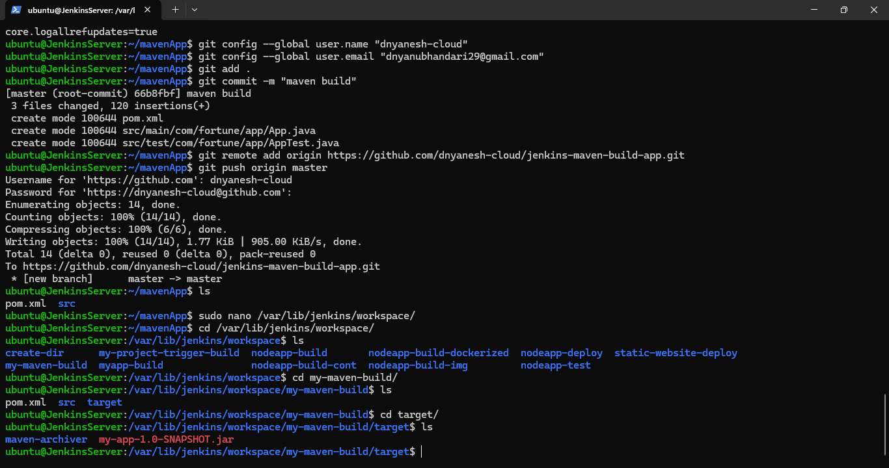
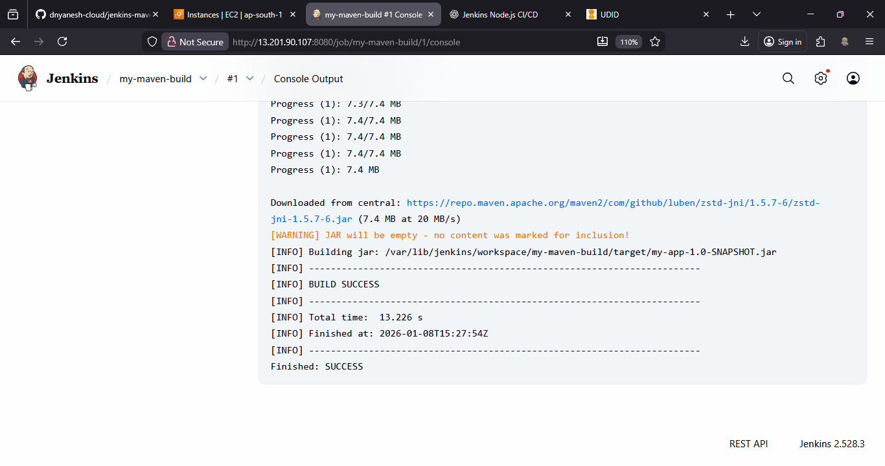

# Jenkins Maven App Build & Test CI/CD Project

This project explains how to **build and test a Java application using Maven and Jenkins**. Maven is used to compile code and package it into a **.jar or .war** file, while Jenkins automates the build and test process.

---

## What is Maven?

* Maven is a **build automation tool** for Java projects
* Used to **compile**, **test**, and **package** applications
* Generates **JAR** (application-based) or **WAR** (web-based) files
* Uses `pom.xml` for dependency and build management

---

## Project Structure

```
MavenApp/
├── pom.xml
├── src
│   ├── main
│   │   └── com/fortune/app/App.java
│   └── test
│       └── com/fortune/app/AppTest.java
```

---

## Step 1: Create Maven Project Directory on Jenkins Server

```bash
mkdir MavenApp
cd MavenApp
mkdir -p src/main/com/fortune/app src/test/com/fortune/app
touch pom.xml src/main/com/fortune/app/App.java src/test/com/fortune/app/AppTest.java
sudo apt install tree -y
tree
```

---

## Step 2: Add Code Files

> Copy source code from repository or sample project

```bash
sudo nano pom.xml
sudo nano src/main/com/fortune/app/App.java
sudo nano src/test/com/fortune/app/AppTest.java
```

### Important Checks Before Push

* Package name in **App.java**: `com.your-company.app`
* Package name in **AppTest.java**: `com.your-company.app`
* `pom.xml`:
  * Ex. Replace `mycompany` → `fortune`

---

## Step 3: Configure Maven & JDK Tools in Jenkins

1. Jenkins Dashboard → **Manage Jenkins**
2. Go to **Tools**

### Maven Installation

* Click **Add Maven**
* Name: `mymaven`
* Install automatically (recommended)

### JDK Installation

* Click **Add JDK**
* Name: `myJDK`
* Install automatically

Click **Save**

---

## Step 4: Create Jenkins Maven Build Job

### Job Details

* **Job Name:** `maven-build`
* Type: Freestyle Project

### Configuration

* Source Code Management:

  * Git Repository URL: `maven-app`
  * Branch: `*/master`

* Build Triggers:

  * GitHub hook trigger for SCM polling

* Build Step:

  * **Invoke top-level Maven targets**

    * Maven Version: `mymaven`
    * Goals: `clean package`

Save

---

## Step 5: Push Project to GitHub

```bash
git init
git add .
git commit -m "Initial Maven app"
git branch -M master
git remote add origin <GITHUB-REPO-URL>
git push origin master
```

✔ Build will start automatically

---

## Step 6: Verify Build Output

* JAR file is generated at:

```
/var/lib/jenkins/workspace/maven-build/target/
```


* Jenkins Build Status: **SUCCESS**



---

## Step 7: Create Downstream Maven Test Job

### Job Details

* **Job Name:** `maven-test`
* Type: Freestyle Project

### Configuration

* Source Code Management:

  * Same Git Repository

* Build Trigger:

  * Build after other projects are built
  * Triggered by: `maven-build`

* Build Step:

  * Invoke top-level Maven targets

    * Maven Version: `mymaven`
    * Goals: `test`
* Post-Build Step:

  * E-mail notification:
    * `<developers-email>`

Save


---

## Step 8: Configure Email Notification (Post-Build Action)

### Jenkins Email Setup

1. Jenkins Dashboard → **Manage Jenkins**
2. Go to **System** → Email Notification

Fill details:

* SMTP Server: `smtp.gmail.com`
* Use SMTP Authentication: ✔
* Username: `<your-email>`
* Password: `<Gmail App Password>`
* Use SSL: ✔
* SMTP Port: `465`
* Default User Email Suffix: `<your-email>`
* advance setting : `<developers-email>` 

Click **Test configuration** → Send Test Email

Save

---

### Generate Gmail App Password

1. Google Account → Manage Account
2. Security → Turn ON **2-Step Verification**
3. Search **App Passwords**
4. App Name: `jenkins`
5. Generate → Copy password (shown once)

---

## Final CI/CD Flow Summary

GitHub Push → Jenkins Maven Build → Jenkins Maven Test (fail) → Email Notification

---

## Key Outcomes

* Java project built using Maven
* JAR file generated successfully
* Automated testing using Jenkins
* Email notification after test fail
